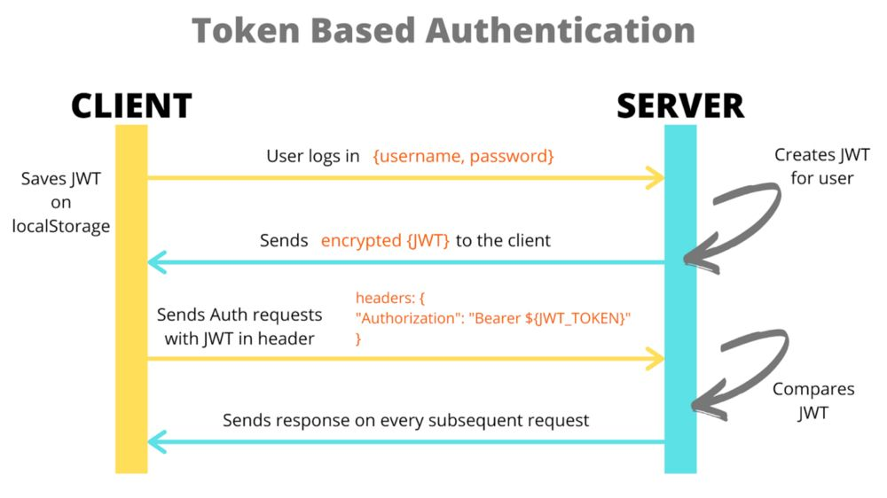
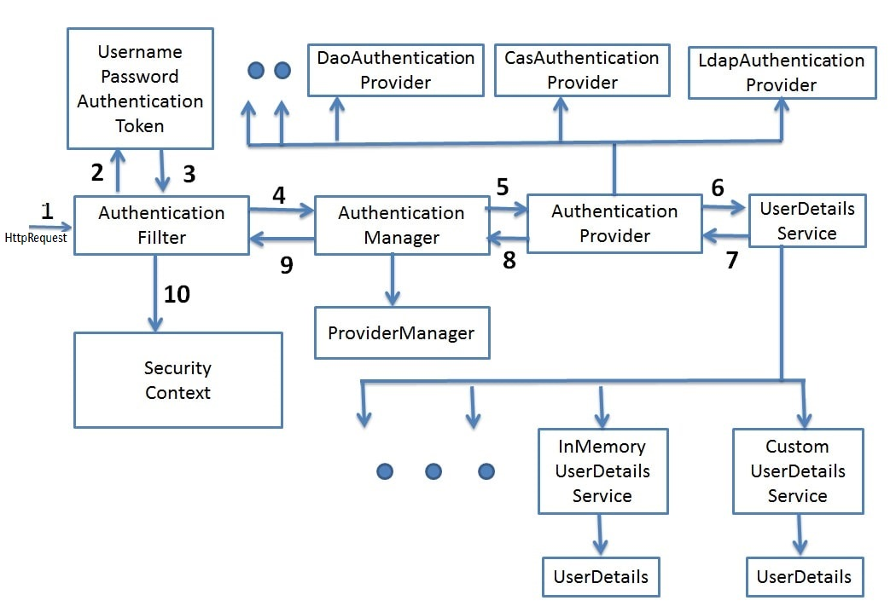

# Spring Security authentication and authorization with JWT 

This project provides an implementation of user authentication and authorization using JWT. 
Includes implementation of features such as registration, roles authorization, refresh token, email verification with \
token, reset password with token. Works with Java 17 and Spring Boot 3 with Spring Security 3.



Learn more: https://www.javainuse.com/webseries/spring-security-jwt/chap3
https://docs.spring.io/spring-security/reference/6.0/servlet/authorization/authorize-http-requests.html

## Features

### User authentication
The user can authenticate by providing a username and password. The username must be unique and it's set to be the 
email. The user receives a JWT token that is used to access protected resources once the credentials are verified, along
with a refresh token that is used to refresh the JWT token. The JWT token is valid for 10 minutes and the refresh token 
is valid for 30 minutes, other values can be set in the application.yml file, by changing the `accessTokenExpirationTime` and `resetTokenExpirationTime` configs,
respectively. The login endpoint can be customized by changing the configuration `loginUrl` in the application.yml.

**Request:**

```http request
POST /api/v1/login
```
 with body:
```json
{
    "username": "user",
    "password": "password"
}
```

**Response:**

```200 OK```
```json
{
  "access_token": "****",
  "refresh_token": "****"
}
```

| Status Code | Description             | Cause                              |
|:------------|:------------------------|------------------------------------|
| 200         | `OK`                    |
| 401         | `UNAUTHORIZED`          | Bad credentials/Username not found |
| 500         | `INTERNAL SERVER ERROR` | |

### User registration
The user can register by providing a first name, last name, an email and a password. The account is disabled once the 
registration is complete. The user receives an email with a verification token to activate the account. This email can 
be customized in ***.

```http request 
POST http://localhost:8080/api/v1/registration
```
with body:
```json
{
    "firstName": "John",
    "lastName": "Doe",
    "email": "john@doe.com",
    "password": "password"
}
``` 
todo
| Status Code | Description             | Cause                              |
|:------------|:------------------------|------------------------------------|
| 200         | `OK`                    |
| 401         | `UNAUTHORIZED`          | Bad credentials/Username not found |
| 500         | `INTERNAL SERVER ERROR` | |


### Email verification
```http request
GET /api/v1/registration/confirm?token=<token>
```


| Parameter | Type | Description                           |
|:----------| :--- |:--------------------------------------|
| `token`   | `string` | **Required**. Your confirmation token |

## How it works
This project uses Spring Security to handle the authentication and authorization of users. The version used is version 6,
which has some changes from the previous version (check migration guide [here](https://docs.spring.io/spring-security/reference/5.8/migration/index.html)).
The following schema describes the relation between the several classes involved in Spring Security workflows.



### WebSecurityConfig

The `WebSecurityConfig` is the configuration class that holds the configuration beans necessary for implementing security.
The `@EnableWebSecurity` annotation is used to enable the security configuration. Several values are configured via `application.yml`.
The `AUTH_WHITELIST` contains URLs templates that aren't secured, for example, login URL and registration cannot have the 
security filter applied to them.
There are also URLs protect via roles, for example, the `/api/v*/admin/**` URL is protected and only users with the role
ADMIN can access it.
There are two custom filters added to the filter chain, one for authentication, `CustomAuthenticationFilter`, and one for
authorization, `CustomAuthorizationFilter`. The authorization filter is added before the UsernamePasswordAuthenticationFilter 
because ***. We set the session management policy to `STATELESS` to avoid creating sessions for the users*** as we want 
the filter to check the JWT at every request.

We also configured the bean `authenticationFailureHandler` with a custom `CustomAuthenticationFailureHandler` class that
replaces the error handling on the authentication filter, after a failed authentication. Otherwise the default behaviour
was to return a 401 status code, without additional details.


### Guides

The following guides illustrate how to use some features concretely:

* [Accessing Data with JPA](https://spring.io/guides/gs/accessing-data-jpa/)
* [Securing a Web Application](https://spring.io/guides/gs/securing-web/)
* [Spring Boot and OAuth2](https://spring.io/guides/tutorials/spring-boot-oauth2/)
* [Authenticating a User with LDAP](https://spring.io/guides/gs/authenticating-ldap/)
* [Building a RESTful Web Service](https://spring.io/guides/gs/rest-service/)
* [Serving Web Content with Spring MVC](https://spring.io/guides/gs/serving-web-content/)
* [Building REST services with Spring](https://spring.io/guides/tutorials/rest/)

## Installing

Run Postgres docker container:

`docker run --name postgres-db -e POSTGRES_PASSWORD=secretpassword -d -p 5432:5432 postgres`

Run maildev docker container:

`docker run -p 1080:1080 -p 1025:1025 maildev/maildev`

Access the maildev interface at `http://localhost:1080`

### Dependencies documentation

For further reference, please consider the following sections:

* [Official Apache Maven documentation](https://maven.apache.org/guides/index.html)
* [Spring Boot Maven Plugin Reference Guide](https://docs.spring.io/spring-boot/docs/3.2.4/maven-plugin/reference/html/)
* [Create an OCI image](https://docs.spring.io/spring-boot/docs/3.2.4/maven-plugin/reference/html/#build-image)
* [Spring Data JPA](https://docs.spring.io/spring-boot/docs/3.2.4/reference/htmlsingle/index.html#data.sql.jpa-and-spring-data)
* [Java Mail Sender](https://docs.spring.io/spring-boot/docs/3.2.4/reference/htmlsingle/index.html#io.email)
* [Spring Security](https://docs.spring.io/spring-boot/docs/3.2.4/reference/htmlsingle/index.html#web.security)
* [Spring Web](https://docs.spring.io/spring-boot/docs/3.2.4/reference/htmlsingle/index.html#web)
* [MailDev](https://github.com/maildev/maildev)
* [Java JWT](https://github.com/auth0/java-jwt)

### References

* [Tutorial for user registration with email verification](https://www.youtube.com/watch?v=QwQuro7ekvc)
* [Tutorial on implementing JWT](https://www.youtube.com/watch?v=VVn9OG9nfH0)
